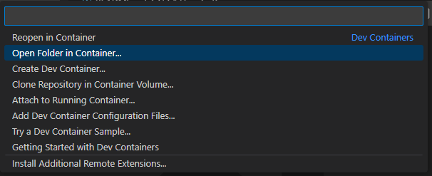

# Description
This is a Node.js based project to learn prisma.

# Requirement

- Docker
- Docker Compose (version: 3)
- Visual Studio Code
  - Dev Containers (extension)

# How to Run
#### 1. Clone this repository and open in VS Code.
  　
#### 2. Open terminal and execute docker-compose up.

```sh
> docker-compose up -d
```
  
#### 3. Open Container by Dev Container extension.
   

#### 4. Update [scripts.ts](./script.ts) as you like.
  　
#### 5. Run Scrict.

```sh
> npm run devStart
```
